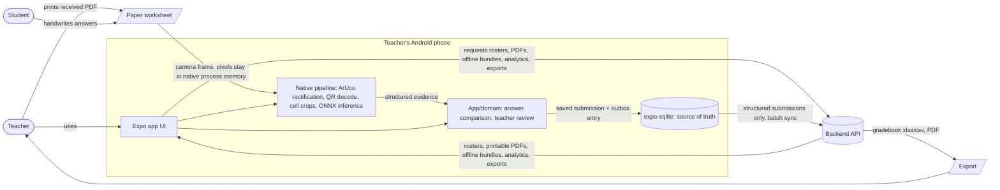

# System Context

## Context / data-flow

## Trust boundaries

- **Zero-photo boundary:** pixel data — camera frames and derived crops — is confined to native process memory inside the pipeline and discarded when processing completes. No image data crosses into JS, SQLite, the filesystem, the network, logs, crash reports, or exports.
- **Sync payload:** ~1–2 KB JSON per sheet — letters, statuses, confidences, scores, overrides. Never images.
- **Backend** owns rosters, printable PDFs, offline bundles, historical analytics, and gradebook exports.
- **Device** owns the camera pipeline, OCR, answer comparison, teacher review, and durable unsynced state.
