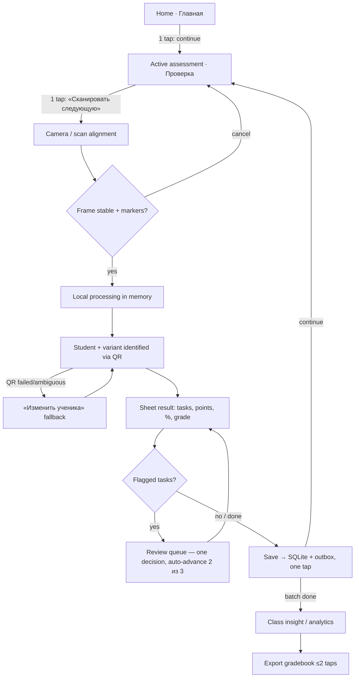
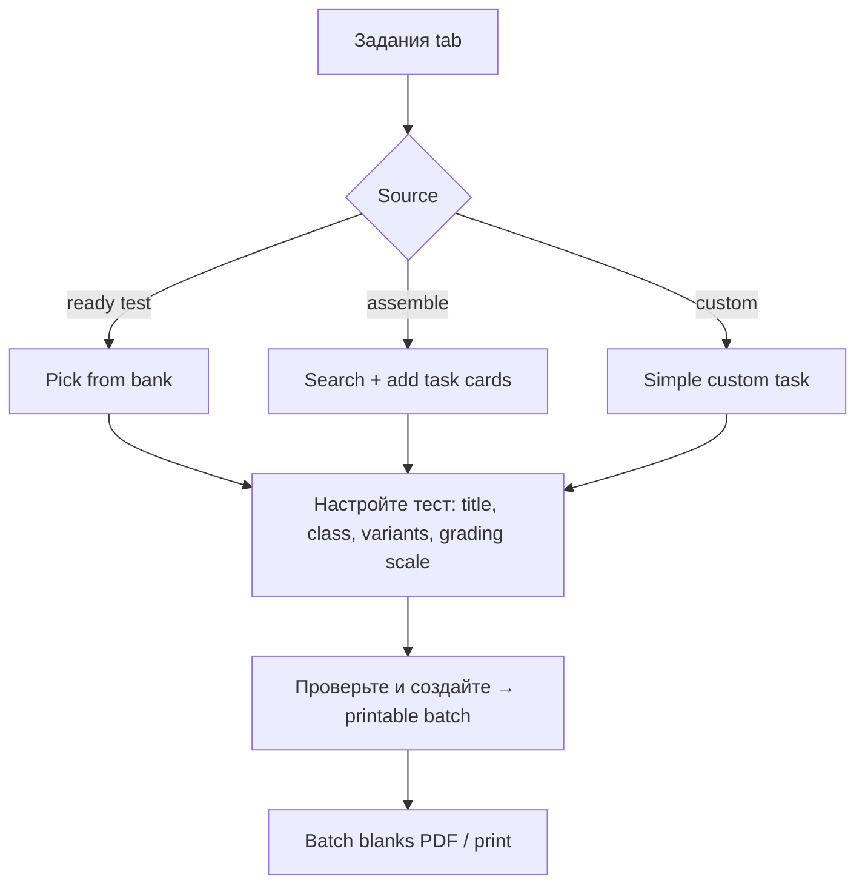
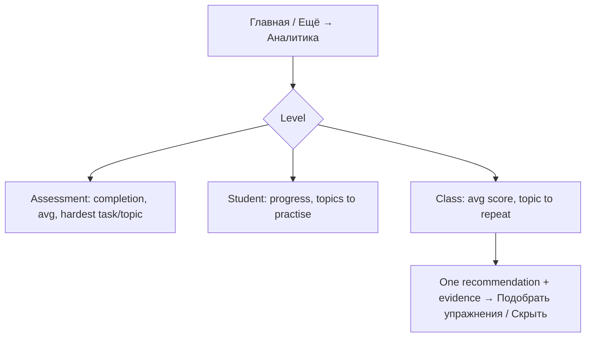
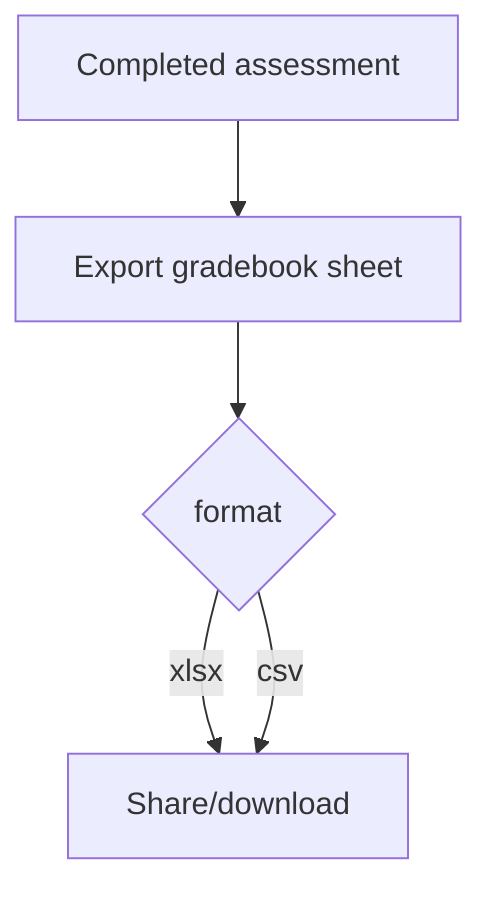

# User Flows

## Primary flow — check a class batch

Offline state: the entire A→J path runs offline. Outbox badge shows pending sync; sync happens on connectivity restore without blocking scanning.

## Secondary flow — create assessment

Cancellation: any step exits back to Задания with the draft preserved or discarded on confirmation.

## Secondary flow — analytics & insight

## Secondary flow — export

## Rules

- Key actions ≤3 taps from home: continue checking (1), scan next (2), open key insight (1), export (≤2 after opening assessment).
- Each screen implements the states applicable to its data and actions; every async path has loading/error recovery, and network-dependent screens expose offline/sync-pending behavior where relevant; scan cancellations always return to a safe state with nothing half-saved.
- Review auto-advances after each decision; the teacher can always reopen and change an outcome before sync.
